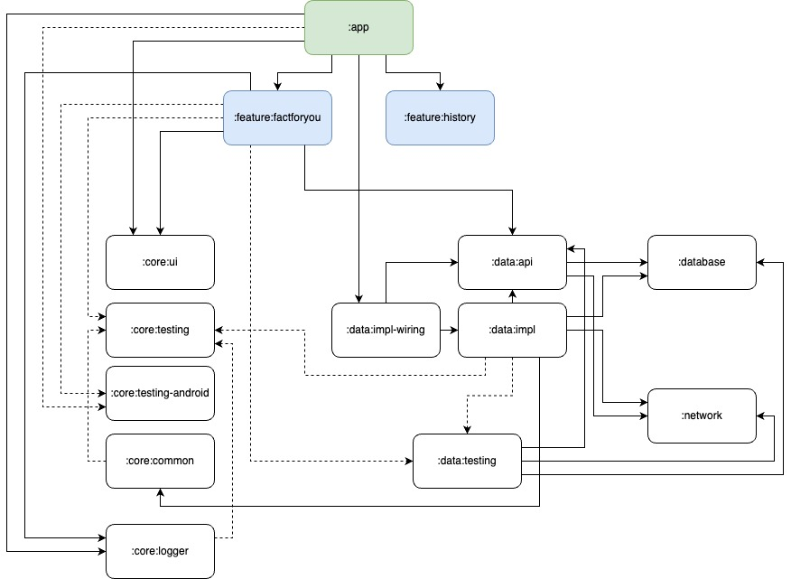

# App Modularization Details

## Graph

## Modules Details

### :app

- Related to MainActivity as the main app UI container, navigation host & graph declaration, and
  core DI definitions.

### :feature:xxx

- Implementations of a particular features, such as Composable screens (UI), ViewModels, and also
  declaration of the navigations to all page navigable on this module.

### :data:api

- Public API interfaces & models that can be consumed by other modules, specially the feature
  modules.
- Usually the exposed APIs will be Domain models & Repository Interfaces.

### :data:impl

- Implementations related to Data Layers code (Repository & Data Source).

### :data:impl-wiring

- DI wiring codes to Bind public API defined on `:data:api` to its implementation on `:data:impl`.

### :data:testing

- Fake implementations of Data Layers code.

### :database

- Contains Room implementation & DAO and DI provider code.

### :network

- Contains Retrofit implementation for Backend communication API and DI provider code.

### :core:common

- Common utilities accessible for any modules, not restricted with architectural layering.

### :core:ui

- All commons UI components / units, resources, and UI-layer level utilities.

### :core:testing

- Common libraries & utils used as a common dependency for unit testing.

### :core:testing-android

- Common libraries & utils used as a common dependency for instrumentation testing.

## Technical Decision on Modularization Strategy

### What is the main idea of this app modularization? Why do you make this kind of structure?

The whole modularization strategy are inspired from a Droidcon talk that I happen to found couple
years ago, titled
the [Android at Scale @Square](https://speakerdeck.com/vrallev/android-at-scale-at-square), and
the [Now In Android](https://github.com/android/nowinandroid) sample project.

The idea is to minimize the dependency needs of a particular module. For example, a **feature module
** doesn't need to know the implementation of the data module that it uses to get the data. They
only need to know the **API interface & public models** that are provided by the data module.

Hence, the data layer which commonly contains of Repository & Data Source class definitions &
implementations, now separated into three part :

1. `:data:api`, contains all the communication interface that can be used to get the data provided
   and also public model definition (usually a domain level model, not DTOs model).

2. `:data:impl`, contains all the implementations of the Repository & Data Source class related
   flows.

3. `:data:impl-wiring`, contains only definitions of DI modules to provide pairings between the
   interfaces and the implementations.

As I just faced by one kind of business domain, which is the cats fact catalog, I just make it as
one big module, the `:data` module, with the mentioned 3 sub-modules.

In the future if I happen to add another business domain on our app, I can separate it into new big
module, with each will also implement the 3 sub-modules.

### Why there is no domain layer codes here?

Domain layer usually contains of domain models and use case classes. In my opinion, use case classes
can be introduced when we have complex business logic that can be reused in multiple places.

As this app is only contains simple business logic, I directly use the Repository interface on the
ViewModels, with the constraint of always using domain models when communicating between
ViewModels & Repository.

Sometimes, use case class usage can be introduced as a rules, so whether it contains complex or
simple business logic, we can force our team to always use them on communication between
ViewModels & Repository. But for this project, I chose not.
